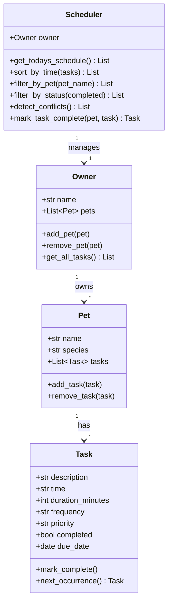

# PawPal+ (Module 2 Project)

You are building **PawPal+**, a Streamlit app that helps a pet owner plan care tasks for their pet.

## Scenario

A busy pet owner needs help staying consistent with pet care. They want an assistant that can:

- Track pet care tasks (walks, feeding, meds, enrichment, grooming, etc.)
- Consider constraints (time available, priority, owner preferences)
- Produce a daily plan and explain why it chose that plan

Your job is to design the system first (UML), then implement the logic in Python, then connect it to the Streamlit UI.

## What you will build

Your final app should:

- Let a user enter basic owner + pet info
- Let a user add/edit tasks (duration + priority at minimum)
- Generate a daily schedule/plan based on constraints and priorities
- Display the plan clearly (and ideally explain the reasoning)
- Include tests for the most important scheduling behaviors

## Getting started

### Setup

```bash
python -m venv .venv
source .venv/bin/activate  # Windows: .venv\Scripts\activate
pip install -r requirements.txt
```

### Suggested workflow

1. Read the scenario carefully and identify requirements and edge cases.
2. Draft a UML diagram (classes, attributes, methods, relationships).
3. Convert UML into Python class stubs (no logic yet).
4. Implement scheduling logic in small increments.
5. Add tests to verify key behaviors.
6. Connect your logic to the Streamlit UI in `app.py`.
7. Refine UML so it matches what you actually built.

## Features

- **Owner and pet management** - create an owner, add multiple pets (dog, cat, rabbit, etc.)
- **Task scheduling** - assign tasks to pets with a time, duration, priority, and due date
- **Sorting by time** - today's schedule is always displayed in chronological HH:MM order
- **Filtering** - view tasks by pet name or by completion status (pending vs. done)
- **Conflict warnings** - the scheduler flags any two tasks for the same pet at the same time
- **Recurring tasks** - daily and weekly tasks auto-schedule their next occurrence when marked complete
- **CLI demo** - run `python main.py` to exercise all features in the terminal without Streamlit

## Smarter Scheduling

The `Scheduler` class adds four algorithmic features on top of basic task storage:

| Feature | Method | How it works |
|---|---|---|
| Sort by time | `sort_by_time()` | Uses Python's `sorted()` with a lambda key on the HH:MM string |
| Filter by pet | `filter_by_pet(name)` | Case-insensitive match against pet name |
| Filter by status | `filter_by_status(completed)` | Boolean match on `Task.completed` |
| Conflict detection | `detect_conflicts()` | Tracks `(pet, time, date)` tuples; duplicate = warning string |
| Recurring tasks | `mark_task_complete()` | Delegates to `Task.next_occurrence()` which adds `timedelta(days=1)` or `timedelta(weeks=1)` |

## System Architecture (UML)



## Testing PawPal+

```bash
python -m pytest
```

The test suite in `tests/test_pawpal.py` covers:

- Task completion status changes after `mark_complete()`
- Adding a task correctly grows a pet's task list
- `sort_by_time` returns tasks in chronological order
- Daily recurrence lands on `due_date + 1 day`
- Weekly recurrence lands on `due_date + 7 days`
- One-time tasks return `None` from `next_occurrence()`
- `mark_task_complete` adds the next occurrence to the pet's task list
- Conflict detection flags duplicate `(pet, time, date)` combinations
- No false positives when task times differ

**Confidence level: 4/5** - all 9 tests pass covering happy paths and key edge cases. The one gap is
overlapping-duration detection (two tasks that start at different times but overlap in duration).

## 📸 Demo

Run the app locally with:

```bash
streamlit run app.py
```
